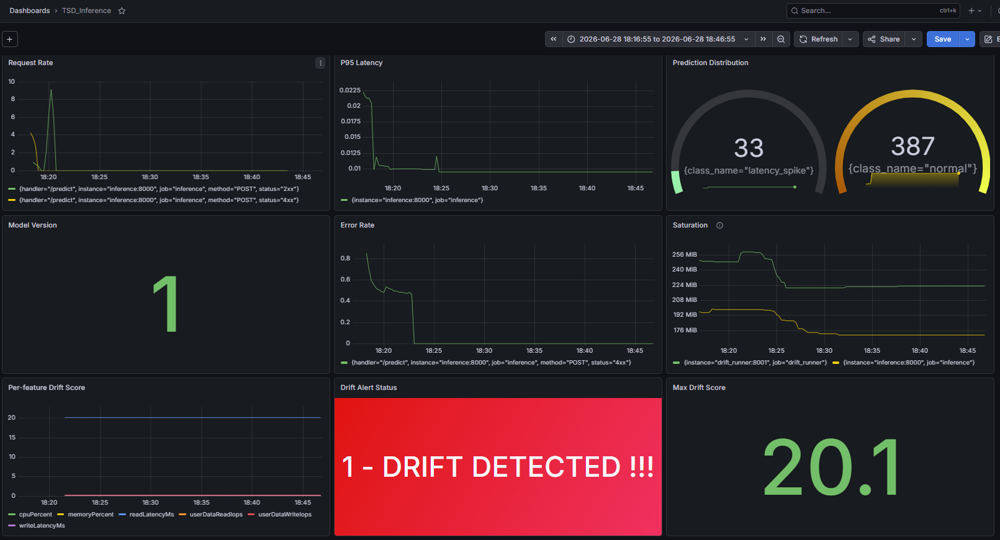

# Infastructure Telemetry Anomaly Detection

A production-grade anomaly detection pipeline for infrastructure telemetry, inspired by storage array monitoring patterns.

## Motivation

A typical storage arrays emit continuous telemetry — disk IOPS, read/write latency, CPU, memory — at high frequency. Detecting anomalies in this stream early (disk degradation, I/O error bursts, latency spikes, node failures) reduces mean time to detection and prevents cascading failures.

This project implements the full MLOps workflow: data simulation → feature engineering → model training → ONNX export → FastAPI inference service → drift detection → canary deployment.

## Architecture

```
Simulated Telemetry
       │
       ▼
Feature Engineering (rolling statistics, pct change)
       │
       ▼
Model Training (XGBoost + IsolationForest) ──► MLflow Registry
       │
       ▼
ONNX Export + Quantization 
       │
       ▼
FastAPI Inference Service (ONNX Runtime, Singleton loader)
       │
       ▼
Prometheus + Grafana (request latency, prediction distribution, drift metrics)
       │
       ▼
Drift Detection (PSI/KL divergence) ──► Retraining Trigger
       │
       ▼
Canary Deployment (K8s traffic split, automated rollback)
```

## Dataset

Synthetic Storage Array telemetry — 10,000 rows at 1-minute intervals (~7 days). Features include:

| Feature | Description |
|---|---|
| `userDataReadIops` | Read IOPS with time-of-day pattern (sinusoidal, peaks at noon) |
| `userDataWriteIops` | Write IOPS with correlated time-of-day pattern |
| `readLatencyMs` | Read latency in milliseconds |
| `writeLatencyMs` | Write latency in milliseconds |
| `cpuPercent` | Node CPU utilisation |
| `memoryPercent` | Node memory utilisation |

Four anomaly types injected into non-overlapping windows:

| Label | Type | Signal |
|---|---|---|
| 1 | Disk Degradation | Gradual IOPS decline over 500 rows (hardest to detect — slow drift) |
| 2 | I/O Error Burst | Sudden 3x write IOPS spike + 5x write latency increase |
| 3 | Latency Spike | Read/write latency jumps by 10-15ms, IOPS unaffected |
| 4 | Node Failure | All metrics drop to near-zero |

Class distribution: ~91% normal, ~9% anomalous (realistic imbalance for infrastructure telemetry).

## Feature Engineering

Rolling features computed over 5-minute windows and 1-hour pct change for all IOPS and latency columns:

- `*_rolling_mean_5m` — smoothed signal, filters noise
- `*_rolling_std_5m` — captures volatility, spikes in variance precede failures
- `*_pct_change_1h` — key signal for disk degradation (gradual decline invisible in raw values)

XGBoost operates on single rows — temporal context must be engineered explicitly.

## Project Structure

```
TSD/
├── data/
│   └── simulated_data.csv           # Generated telemetry dataset
├── models/
│   ├── xgboost_tsd_model.onnx       # Exported ONNX model
│   └── xgboost_tsd_model_quantized.onnx  # Quantized ONNX model
├── notebooks/
│   └── TSD_001_data_simulation.ipynb     # Simulation, feature engineering, EDA
├── serving/
│   ├── app/
│   │   ├── main.py          # FastAPI app, lifespan, /predict, /predict/batch, metrics
│   │   ├── inference.py     # ONNXInferenceEngine (ONNX Runtime session)
│   │   ├── schema.py        # InferenceRequest (18 fields), InferenceResponse
│   │   ├── health_check.py  # /health/live, /health/ready
│   │   ├── config.py        # Pydantic BaseSettings, reads .env
│   │   └── logger.py        # JSON structured logging
│   ├── Dockerfile           # ONNX-Runtime serving image
│   └── requirements.txt
├── monitoring/
│   ├── prometheus.yml       # Scrape config (inference:8000/metrics)
│   └── grafana/dashboards/  # Version-controlled dashboard JSON
├── src/
│   └── simulate.py          # Reusable simulation module
├── docker-compose.yml       # mlflow + inference + prometheus + grafana
└── requirements.txt
```

## Stack

- **Data:** pandas, numpy
- **ML:** scikit-learn, XGBoost, ONNX Runtime
- **Experiment tracking:** MLflow
- **Serving:** FastAPI, ONNX Runtime, uvicorn
- **Monitoring:** Prometheus, Grafana
- **Drift detection:** Evidently
- **Infra:** Kubernetes, Docker

## Monitoring Dashboard

Single Grafana dashboard covering the four golden signals (TSD-006) and data-drift
detection (TSD-008). Drift panels: per-feature drift score with a threshold line,
a 0/1 drift-alert status, and the max drift score across features.



## Status

| Ticket | Status | Description |
|---|---|---|
| TSD-001 | ✅ Done | Data simulation, feature engineering, EDA |
| TSD-002 | ✅ Done | XGBoost (multi:softprob, 5-class, sample_weight balanced) + IsolationForest. Both tracked in MLflow with params, metrics, classification report. Registered with `champion` alias in MLflow model registry. |
| TSD-003 | ✅ Done | XGBoost exported to ONNX via onnxmltools. Benchmark: native XGBoost 2x faster than ONNX Runtime (expected for tree ensembles — no operator fusion). Dynamic int8 quantization applied — no size reduction (tree models have no weight matrices). ONNX value: portability + single runtime dependency in serving container. |
| TSD-004 | ✅ Done | FastAPI inference service — ONNX Runtime serving, Singleton model loader (double-checked locking), `/predict` (single) + `/predict/batch`, `/health/live` + `/health/ready`, structured JSON logging. Client sends all 18 features (6 raw + 12 rolling). Inference latency ~18ms. Known limitation: rolling features computed client-side — per-device server-side buffer deferred to TSD-004b (requires Redis, absorbed into TSD-006). |
| TSD-005 | ✅ Done | MLflow registry integration + hot-reload — model loaded from registry at startup via `champion` alias (no model baked into image). Background daemon thread polls MLflow every 60s, atomically swaps `app.state.model` with `threading.Lock` on new champion version. Previous model retained in `app.state.previous_model` for rollback. ONNX artifact logged via `mlflow.onnx.log_model`. Startup time ~5s (MLflow download) vs ~80ms (local file). |
| TSD-006 | ✅ Done | Prometheus + Grafana observability — full stack via Docker Compose (mlflow, inference, prometheus, grafana). Custom metrics: `prediction_class_total` (Counter, labelled by class), `model_version` (Gauge). Auto metrics via `prometheus-fastapi-instrumentator`: request count, latency histogram. Grafana dashboard covers all 4 golden signals — Latency (P95), Traffic (request rate), Errors (4xx/5xx rate), Saturation (resident memory) — plus prediction distribution + live model version. Dashboard JSON version-controlled in `monitoring/grafana/dashboards/`. |
| TSD-007 | ✅ Done | Redis per-device rolling buffer (promoted from TSD-004b) — feature computation moved server-side. Client now sends `deviceID` + 6 raw features only; server maintains a per-device history list in Redis (`device:{id}` key) and computes the 12 rolling features, eliminating client-side training/serving skew. Buffer depth = 61 (max feature lookback: `pct_change(periods=60)` needs 60 prior readings + the current one). Rolling features reuse the exact training-time pandas math, with an explicit `FEATURE_ORDER` select to enforce column order into the ONNX model. Cold-start gate returns HTTP 425 until the buffer holds 61 readings (reject over impute — fabricated features are indistinguishable from real ones to the model). Append + trim + expire + count + read run in a single Redis pipeline (MULTI/EXEC) so concurrent requests for the same device cannot interleave and corrupt the window — the distributed analogue of the `threading.Lock` used for the model swap in TSD-005. Sliding TTL (2h, > the ~61-min buffer span) auto-reclaims dead devices; AOF persistence intentionally off (buffer is reconstructible — a restarted device re-warms in ~61 readings). Redis added as a 5th Docker Compose service. Inference latency ~9.5ms steady-state (Redis round-trip sub-millisecond). |
| TSD-008 | ✅ Done | Data drift detection — monitors covariate shift on the 6 raw features (data drift is detectable label-free; concept drift is not, since live anomaly labels are unavailable). Serving service appends each incoming reading to a separate global Redis list (`drift:samples`, capped ~5000, no TTL — deliberately different config from the TSD-007 per-device buffer: a *population* sample for distribution estimation vs a *point* query for current features), under a best-effort `try/except` so a monitoring failure never breaks `/predict`. A standalone scheduled `drift_runner` process (6th Compose service, decoupled failure domain from serving) compares a live window against a **normal-only reference** (`label==0` rows — anomalies excluded so the baseline means "normal," not "normal+anomalies") using **Evidently 0.7.x** (`DataDriftPreset`, Wasserstein distance). Threshold (1.0) calibrated empirically against the observed noise floor (~0.18) rather than a library default — clean separation from the ~20 drift signal. Per-feature scores exposed as a labelled Prometheus gauge (`feature_drift_score`) plus a 0/1 `drift_alert` gauge for Grafana alerting; runs an own `start_http_server` (long-lived loop, since Prometheus cannot scrape a batch job that exits — Pushgateway is the alternative). On breach: **alert only**, not auto-retrain — retraining stays human-gated because auto-retraining on unlabelled drift can teach the model to accept a degraded state as normal, and the drift sample window is sized for *detection*, not *training* (real retraining sources full-volume data from a warehouse). Also implemented PSI from scratch (quantile bins, frozen reference edges, epsilon smoothing for `ln(0)`) in `src/drift.py` as the "understand it before using the tool" version. Robustness: runner tolerates an empty/cold sample store (skips cycle below `MIN_SAMPLES`). |
| TSD-009 | ⏳ Pending | Canary deployment with automated rollback |
